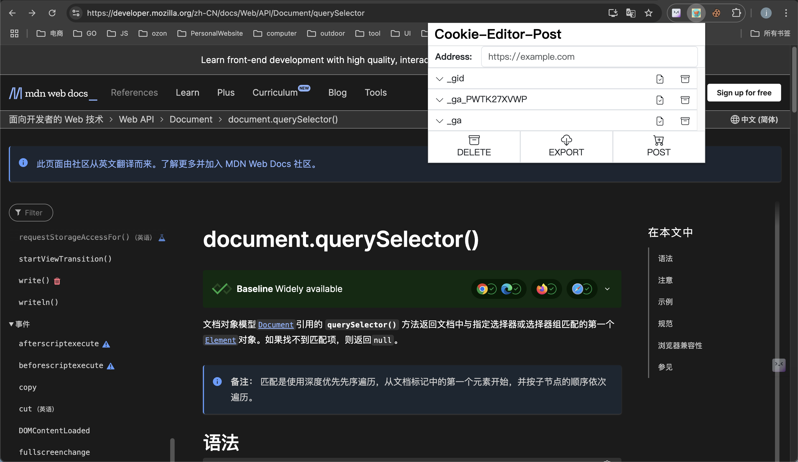
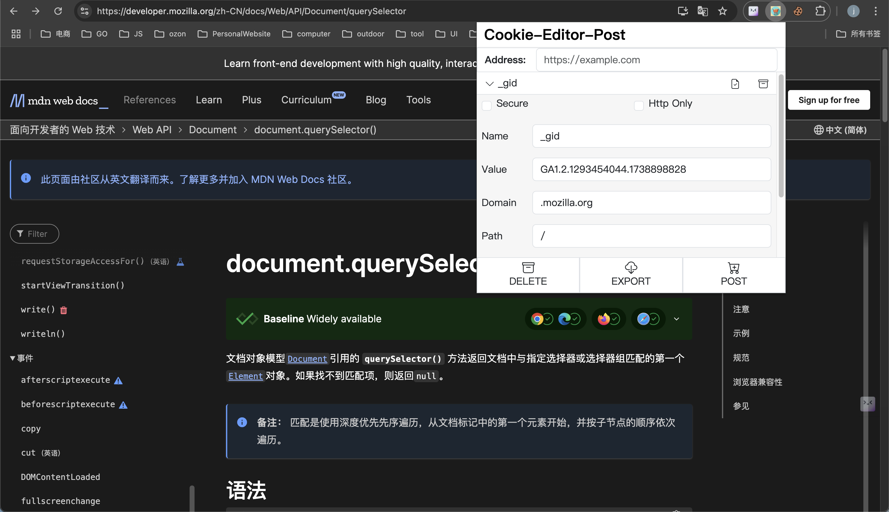

# FetchCookies

## 项目简介
Cooki-Editor-Post 是一个用于从指定网站获取并存储 cookies 的工具。该项目旨在简化网络爬虫和自动化测试中的 cookie 管理。

## 功能特性
## 截图



- 从指定 URL 获取 cookies
- 支持多种存储格式（如 JSON、SQLite 等）
- 提供简单易用的命令行界面
- 支持自定义请求头和代理

## 安装
使用以下命令克隆仓库并安装依赖：
```bash
git clone https://github.com/yourusername/FetchCookies.git
cd FetchCookies
```

## 使用方法
### 本地安装方法

1. 克隆仓库并安装依赖：
    ```bash
    git clone https://github.com/yourusername/FetchCookies.git
    cd FetchCookies
    ```

2. 打开 Chrome 浏览器，进入扩展程序管理页面（在地址栏输入 `chrome://extensions/` 并回车）。

3. 打开右上角的“开发者模式”开关。

4. 点击左上角的“加载已解压的扩展程序”按钮。

5. 选择克隆的 `FetchCookies` 项目文件夹。

6. 安装完成后，您可以在 Chrome 扩展程序中看到 `FetchCookies`。

7. 通过扩展程序图标或命令行界面使用 `FetchCookies` 获取并存储 cookies。

## 贡献
欢迎贡献代码！请提交 pull request 或报告 issues。

## 许可证
该项目基于 MIT 许可证，详情请参阅 LICENSE 文件。